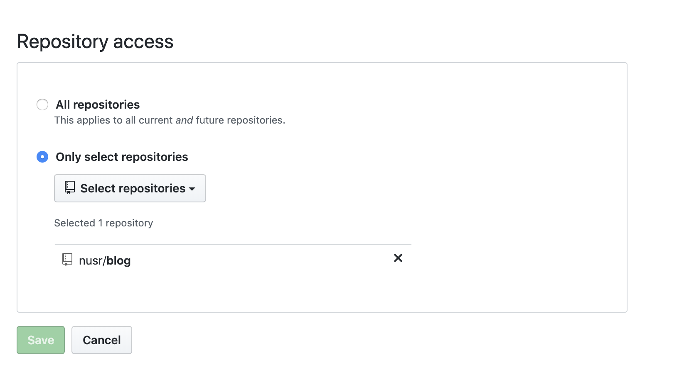

## Table of contents

[utterances](https://github.com/utterance/utterances) 是一款基于 GitHub issues 的评论工具。

相比同类的工具 gitment、gitalk 以及 disqus 评论工具，优点如下：

1. 极其轻量
1. 加载非常快
1. 配置比较简单

<!--more-->

博之前客一直使用 disqus ,这个工具配置也比较简单，也是免费的。但是，广告多，而且加载也比较慢。

体验了一把 utterances 后，马上切换到 utterances。

## 安装 utterances

utterances 的安装相当简单，因为出品了一个 [Github App](https://github.com/apps/utterances)。

首先安装这个 App ，选择要关联评论的仓库。可以选择所有仓库，也可以只选择一个仓库。选择一个仓库比较安全。



安装完成就是配置成功了，是不是非常简单。

## 使用 utterances

在你要使用评论的地方，插入以下代码：

```html
<script
  src="https://utteranc.es/client.js"
  repo="nusr/blog"
  issue-term="pathname"
  theme="github-light"
  crossorigin="anonymous"
  async
></script>
```

**nusr/blog** 是你配置允许访问的仓库，格式为 **user-name/repo-name** 。

或者动态创建 script 标签：

```html
<script type="text/javascript">
  (function () {
    // 匿名函数，防止污染全局变量
    var utterances = document.createElement("script");
    utterances.type = "text/javascript";
    utterances.async = true;
    utterances.setAttribute("issue-term", "pathname");
    utterances.setAttribute("theme", "github-light");
    utterances.setAttribute("repo", "nusr/blog");
    utterances.crossorigin = "anonymous";
    utterances.src = "https://utteranc.es/client.js";
    // content 是要插入评论的地方
    document.getElementById("content").appendChild(utterances);
  })();
</script>
```

我的博客是使用 Hugo 搭建的，可以参考我的[配置 config.toml](https://github.com/nusr/blog/blob/master/config.toml)。

## 配置 utterances

utterances 可以配置主题，评论映射。

主题 **theme** 选项如下：

1. github-light
1. github-dark
1. github-dark-orange
1. icy-dark
1. dark-blue
1. photon-dark

评论 **issue-term** 映射配置选项如下：

1. pathname
1. url
1. title
1. og:title
1. issue-number
1. specific-term

更多配置查看 [https://utteranc.es/](https://utteranc.es/)
